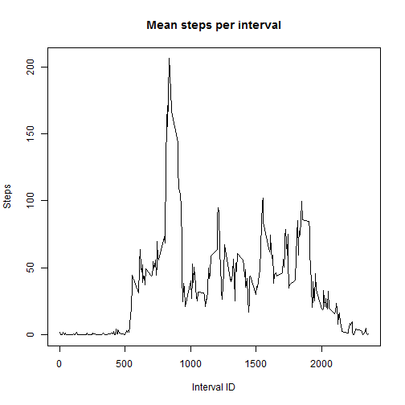
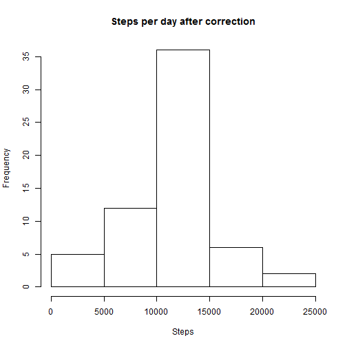
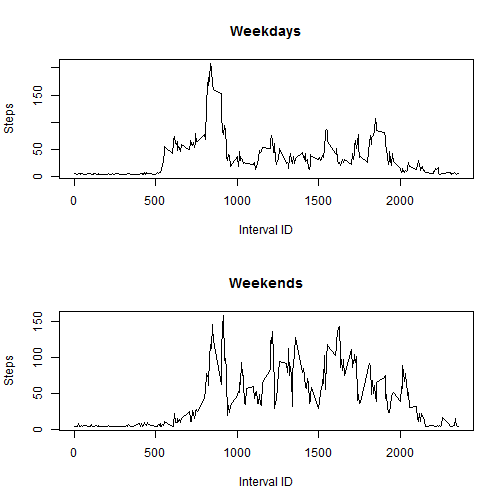

## Loading and preprocessing the data


```r
Sys.setlocale("LC_TIME", "English")
```

```
## [1] "English_United States.1252"
```

```r
activity <- read.csv(unz("activity.zip","activity.csv"))
```

## What is mean total number of steps taken per day?


```r
steps_per_day <- rowsum(activity$steps,activity$date)
hist(steps_per_day,
     xlab="Steps",ylab="Frequency",
     main="Steps per day")
```

 

```r
mean_steps_per_day <- mean(steps_per_day[!is.na(steps_per_day)])
median_steps_per_day <- median(steps_per_day[!is.na(steps_per_day)])
```

The mean number of steps took by the subject on each day is 1.0766189 &times; 10<sup>4</sup>.

The median of the number of steps took by the subject on each day is 10765.

## What is the average daily activity pattern?


```r
library(plyr)
mean_steps_per_interval <- ddply(activity[!is.na(activity$steps),],c("interval"),summarize,steps=mean(steps))
plot(mean_steps_per_interval$interval, mean_steps_per_interval$steps,
     type="l",
     xlab="Interval ID",ylab="Steps",
     main="Mean steps per interval")
```

 

```r
max_steps_interval <- mean_steps_per_interval$interval[mean_steps_per_interval$steps == max(mean_steps_per_interval$steps)]
```

The interval with max number of steps is the one with ID 835

## Imputing missing values

In the previous steps NA values in the dataset were eliminated.

To solve this problem we will substitute the NA values with the mean on all days for the same interval.
The mean is rounded to have an integer number of steps.


```r
find_mean_steps_per_interval <- function(interv) {
     round(mean(activity$steps[!is.na(activity$steps) & activity$interv == interv]))
}
activity$filled_steps <- ifelse(is.na(activity$steps),find_mean_steps_per_interval(activity$interval),activity$steps)
filled_steps_per_day <- rowsum(activity$filled_steps,activity$date)
hist(filled_steps_per_day,
     xlab="Steps",ylab="Frequency",
     main="Steps per day after correction")
```

 

```r
mean_filled_steps_per_day <- mean(filled_steps_per_day)
median_filled_steps_per_day <- median(filled_steps_per_day)
```

After this correction:

* The mean number of steps took by the subject on each day is 1.0751738 &times; 10<sup>4</sup>.

* The median of the number of steps took by the subject on each day is 1.0656 &times; 10<sup>4</sup>.

## Are there differences in activity patterns between weekdays and weekends?


```r
activity$weekday <- weekdays(as.Date(activity$date))
activity$weekday <- ifelse(activity$weekday == "Saturday" | activity$weekday == "Sunday", "weekend", "weekday")
activity$weekday <- factor(activity$weekday)
weekday_mean_steps_per_interval <- ddply(activity[activity$weekday == "weekday",],c("interval"),summarize,steps=mean(filled_steps))
weekend_mean_steps_per_interval <- ddply(activity[activity$weekday == "weekend",],c("interval"),summarize,steps=mean(filled_steps))
par(mfrow=c(2,1))
plot(weekday_mean_steps_per_interval$interval,weekday_mean_steps_per_interval$steps,
     type="l",
     xlab="Interval ID",ylab="Steps",
     main="Weekdays")
plot(weekend_mean_steps_per_interval$interval,weekend_mean_steps_per_interval$steps,
     type="l",
     xlab="Interval ID",ylab="Steps",
     main="Weekends")
```

 
